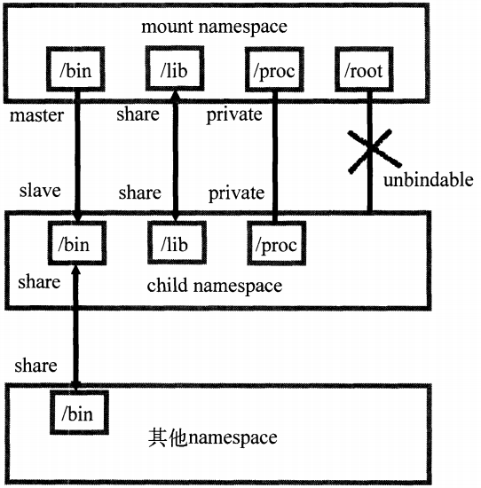
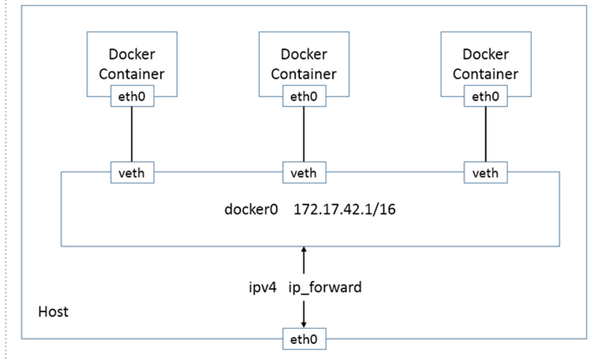

[TOC]
# docker内核知识 

## namespace隔离资源
> linux内核提供6中namespace隔离系统调用

| namespace | 系统调用参数 | 隔离内容 |
| --- | --- | ---- |
| UTS | CLONE_NEWUTS | 主机与域名 |
| IPC | CLONE_NEWIPC | 信号量, 消息队列和内存共享 |
| PID | CLONE_NEWPID | 进程编号 |
| Network | CLONE_NEWNET | 网络设备, 网络栈, 端口等 |
| Mount | CLONE_NEWNS | 挂载点 |
| User | CLONE_NEWUSER | 用户和用户组 |

### 进行namespace API操作的四种方式
* clone()在创建进程的同时, 创建namespace`int clone(int (*child_func)(void *), void *child_stack, int flags, void *args)`
* 查看 `/proc/[pid]/ns`文件
> 如果两个进程的namespace编号一样, 那么就是 同一个namespace下面, /proc/[pid]/ns设置这些link的另外作用, 上述的link被打开, 文件的描述符fd存在, 就算namespace下面的全部进程都结束, namespace还会存在, 其他的进程可以加进来.
* 通过`setns()` 加入一个已经存在namespace
> 在docker中, 想要在已经运行的容器执行命令, 需要系方法. setns调用,  进程从原来的namespace加入一个已经存在的namespace, 为了不影响加入的namespace进程的调度者, 在`setns`执行后,使用`clone`, 创建子进程执行命令, 让原来的进程结束.
* 通过`unshare`在原来的进程隔离, 不启用新的进程.

### UTS namespace
```c
#define _GNU_SOURCE 

#include <sys/types.h>
#include <sys/wait.h>
#include <stdio.h>
#include <sched.h>
#include <signal.h>
#include <unistd.h>

#define STACK_SIZE (1024 * 1024)

static char child_stack[STACK_SIZE];

char* const child_args[] = {"/bin/bash", NULL};

int child_main(void *args) {
    printf("在子进程中!\n");
    sethostname("NewHostName", 12);
    execv(child_args[0], child_args);
    return 1;
}

// UTS命名空间
int main() {
    printf("程序开始: \n");
    int child_pid = clone(child_main, child_stack+STACK_SIZE, CLONE_NEWUTS|SIGCHLD, NULL);
    waitpid(child_pid, NULL, 0);
    printf("程序退出\n");
    return 0;
}
```

### IPC namespace
```c
#define _GNU_SOURCE 

#include <sys/types.h>
#include <sys/wait.h>
#include <stdio.h>
#include <sched.h>
#include <signal.h>
#include <unistd.h>

#define STACK_SIZE (1024 * 1024)

static char child_stack[STACK_SIZE];

char* const child_args[] = {"/bin/bash", NULL};

int child_main(void *args) {
    printf("在子进程中!\n");
    sethostname("Newhostname", 12);
    execv(child_args[0], child_args);
    return 1;
}

/*
    ipcmk -Q //创建一个message queue
    ipcs -q  //查询message queue
    进入子进程后, 在查询, 找不到目标queue.
    进程通信隔离
*/
int main() {
    printf("程序开始: \n");
    int child_pid = clone(child_main, child_stack+STACK_SIZE, CLONE_NEWIPC|CLONE_NEWUTS|SIGCHLD, NULL);
    waitpid(child_pid, NULL, 0);
    printf("程序退出\n");
    return 0;
}
```

* bash只在登陆的时候读取一次uts


### PID namespace
```c
#define _GNU_SOURCE 

#include <sys/types.h>
#include <sys/wait.h>
#include <stdio.h>
#include <sched.h>
#include <signal.h>
#include <unistd.h>

#define STACK_SIZE (1024 * 1024)

static char child_stack[STACK_SIZE];

char* const child_args[] = {"/bin/bash", NULL};

int child_main(void *args) {
    printf("在子进程中!\n");
    sethostname("Newhostname", 12);
    execv(child_args[0], child_args);
    return 1;
}

/*
    ipcmk -Q //创建一个message queue
    ipcs -q  //查询message queue
    进入子进程后, 在查询, 找不到目标queue.
    进程通信隔离

    echo $$ 在主进程看一下, 执行代码后在echo $$会发现1.
*/
int main() {
    printf("程序开始: \n");
    int child_pid = clone(child_main, child_stack+STACK_SIZE, CLONE_NEWPID|CLONE_NEWIPC|CLONE_NEWUTS|SIGCHLD, NULL);
    waitpid(child_pid, NULL, 0);
    printf("程序退出\n");
    return 0;
}
```

* 以树的形式管理pid namespace
* 每个pid namespace第一个进程都是init, 起特殊作用. (管理孤儿)
* namespace中的进程, 不能kill或者ptrace父进程或兄弟进程.
* init进程可以屏蔽信号, 在函数中不处理信号, 就直接屏蔽, `防止init被误杀`. 父进程发送的信号, 不是`SIGKILL`, `SIGSTOP`, 都可以忽略.
* 一旦`init`进程销毁, 同一个`pid namespace`的其他进程收到`sigkill` 信号终止, 如果`/proc/[pid]/ns/pid`处于挂载状态或者是打开状态, 该namespace不会消失,但是保留下来的无法通过`setns`, `fork`创建进程.
* unshare()在创建了pid namesapce后, 调用者进程不进入namespace, 同样setns也是创建pidnamespace不会进入, 接下来创建的子进程才会进入. 一般来说进程在创建之初, pid是固定的, `getpid`根据所在的`pid namespace`返回PID, 进入新的pidnamespace导致pid发生变化, 可能引起程序崩溃.

### mount namespace
> 通过隔离文件系统挂载点对隔离文件系统提供支持. 不同的`mount namespace`,文件系统结构不影响,通过`/proc/[pid]/mounts`查看挂载的信息, 创建mountspace时候, 把当前的文件结构都复制进心的namespace, 但是当父命名空间挂载了CD-ROM, 子进程是无法自动挂载的, 所以出现`挂载传播`, 

* 共享挂载
* 从属挂载
* 共享/主从挂载
* 私有挂载
* 不可绑定挂载

> 传播事件的挂载对象称为`共享挂载`, 接收传播事件的挂载对象称为`从属挂载`, 既不传播也不接受传播事件的挂载称为`私有挂载`, 与私有挂载想再, 不允许执行绑定挂载`不可绑定挂载`

> `mount --make-private --make-shared --make-slave --make-unbindable`

### network namespace
> 主要提供了网络资源的隔离, 一个物理设备最多存在于一个namespace下, 物理设备最初都存在`root namespace`, 如果有多块网卡, 可以将其分配给新的`network namespace`, 当创建的network namespace释放时, 无力网卡反给`root namespace`不是父进程所在的namespace. 关于新旧的namespace如何通信, `veth pair`建立两个namespace的通信, 在开始的时候,使用`pipe` , `docker dameon`负责创建`veth pair`, `docker daemon`和`init`就是通过`pipe`通信, 在docker完成创建`veth`之前, init在另一端循环等待. 收到设备信息, 启动`eth0`.


### user namespace
> `user namespace`主要隔离了相关的标识符和属性. 一个用户通过clone进入新的user namespace可以拥有不同的用户和用户组.
* usernamespace创建之后, 第一个进程赋予了全部的权限, 这样init可以完成全部的初始化工作, 不会出现权限不足导致无法完成.
* usernamespace内部的用户需要与外部简历映射, 可以保证设计一些对外部的操作时候, 可以检验其权限, 用户组也是同样的道理
* 用户在新的user namespace里拥全部的权限, 但是在创建他的父进程namespace中, 不含任何权限, 
* usernamespace与其他的命名空间一同使用, 依旧需要root.解决方案, 以普通用户创建`user nameapce`, 在新的namespace作为root, 然后clone加入其他的命名空间