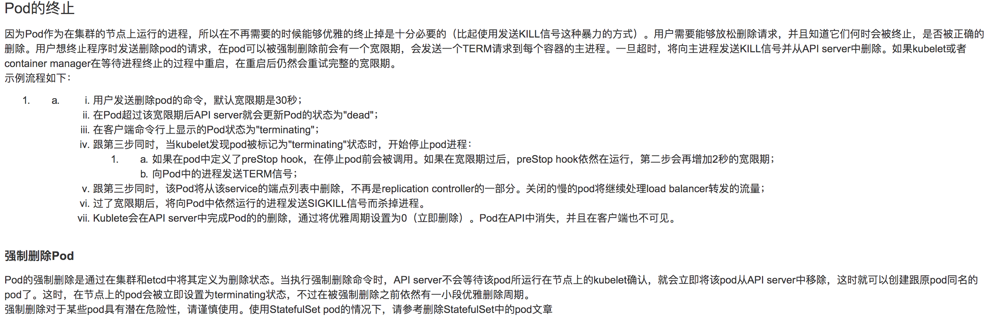
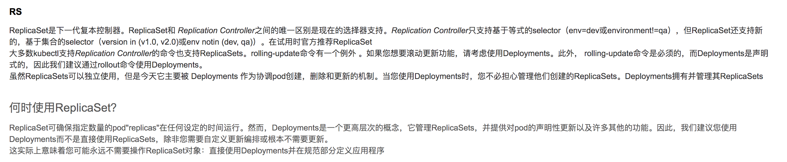
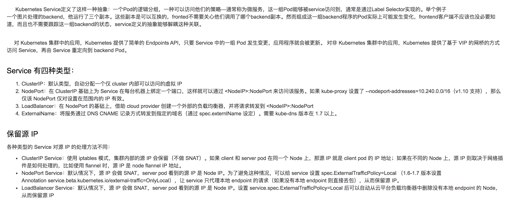

- Labels
> Labels本身就是一对`key-value`,  可以在创建对象时候指定或者创建后在更改。一个对象可以由多个标签，但`key`必须唯一
```json
{
  "labels": {
      "k1": "v1",
      "k2": "v2"
  }
}
```
> `k8s`对labels最终索引和反向索引和watch，对于大型，非标识用`annotation`.

- namespace和node
> `namespace`是对一组资源和对象的抽象集合，在一用来将内部系统划分不同的项目组或者用户组, `pods`, `services`, `replication controller`默认都是`default`, node, persistentVolumns 不属于命名空间, `namespace`常用来隔离用户`k8s`自己的服务在`kube-system` 命名空间，在一个k8s集群中， 可以通过namespace创建多个虚拟集群。也可以通过某种形式，让`namespace`的service能访问其他里的服务

> `node`的状态包括
1. Addres
    hostname: 可以被kbuectl的 --hostname-override替换
    extenalip: 可以被集群外部路由到的ip地址
    internalip: 内部ip，集群外无法访问
2. Condition
    OutOfDisk: 磁盘空间不足的时候为Ture
    Ready: Node controller40秒内没有收到node的状态报告为unknow, 健康true，否则false
    MemoryPressure: node没有内存压力的时候为true，否则false
    DiskPressure: node没有磁盘压力的时候为true，否则为false
3. Capacity
    CPU, 内存，可运行最大的pod数
4. 常用命令
```
kubectl cordon <node> 禁止pod调度到此节点
kubectl drain <node>  驱逐该节点上的所有pod
```

- pod
> pod是集群中可以创建和部署的最小单位，一个pod代表着集群中运行的一个进程。pod中封装着应用的容器，存储，独立的网络和运行策略。
> Pod有两种形式 1在pod中运行一个容器，2在pod中运行多个容器
> 使用多个容器的例子 在pod中有一个web服务和一个sidecar服务，共享数据卷，sidear从其他的地方下载文件。
> pod可以共享 网络和存储。pod内部的容器共享网络空间包括ip和端口，在pod内部通过`localhost`相互通信。
> pod中所有的容器都可以访问共享的`volumn`, 也可用来数据的持久化.
> 你很少会直接在kubernetes中创建单个Pod。因为Pod的生命周期是短暂的，用后即焚的实体。当Pod被创建后（不论是由你直接创建还是被其他Controller），都会被Kuberentes调度到集群的Node上。直到Pod的进程终止、被删掉、因为缺少资源而被驱逐、或者Node故障之前这个Pod都会一直保持在那个Node上。
> 注意：重启Pod中的容器跟重启Pod不是一回事。Pod只提供容器的运行环境并保持容器的运行状态，重启容器不会造成Pod重启。
> Pod不会自愈。如果Pod运行的Node故障，或者是调度器本身故障，这个Pod就会被删除。同样的，如果Pod所在Node缺少资源或者Pod处于维护状态，Pod也会被驱逐。Kubernetes使用更高级的称为Controller的抽象层，来管理Pod实例。虽然可以直接使用Pod，但是在Kubernetes中通常是使用Controller来管理Pod的。
> Controller可以创建和管理多个Pod，提供副本管理，滚动升级和集群级别的自愈能力，例如 如果一个Node故障，Controller就能自动将该节点上的Pod调度到其他健康的Node上



- Replication Controller 和 ReplicaSet
> `Replication Controller`用来保证容器的副本数保持在用户定义的数量，异常退出，会创建新的来代替，而多出来也会自动回收，`rc,rs`本身没有本质的区别，rs支持集合式的selector。



- service
