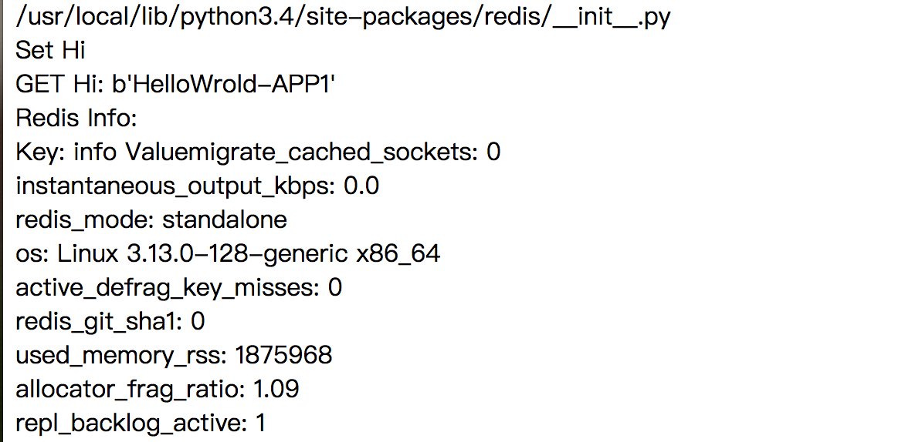

## 使用docker搭建redis的集群, 使用Haporxy做负载均衡. 部署简单web应用
### 默认是root用户的操作

1. Docker安装
>  [MacStable](https://download.docker.com/mac/stable/Docker.dmg)  
>  [Ubuntu](https://docs.docker.com/install/linux/docker-ce/ubuntu/)

2. 了解必要的docker命令
* `docker ps options` 列出本地构建的容器
* `docker attach` 进入容器
* `docker start/stop/restart container` 启动/停止/重启 容器
* `docker run ` 根据一个镜像构造容器, 主要的参数 `--link name:alias` 与那个容器通信　`-v` 数据卷的挂载

3. 拉取必要的镜像
```bash
docker pull ubuntu
docker pull django
docker pull redis
docker pull haproxy
```

4. 构造容器
```bash
# 注意启动顺序
docker run -it --name redis-master redis /bin/bash
docker run -it --name redis-slave1 --link redis-master:master redis /bin/bash
docker run -it --name redis-slave2 --link redis-master:master redis /bin/bash
docker run -it --name app1 --link redis-master:db -v ~/project/django/app1:/usr/src/app1 django /bin/bash
docker run -it --name app2 --link redis-master:db -v ~/project/django/app2:/usr/src/app2 django /bin/bash
dockrt run -it --name HAProxy --link app1:app1 --link app2:app2 -p 6301:6301 -v ~/project/hap:/tmp /bin/bash

`-v`参数说明 宿主机器文件存储路径, 容器文件存储路径.
```

5. 查看redis的默认数据挂载点
`docker inspect container(name.,id) | grep Source`

6. 对redis-master进行配置
* 找到宿主机器的redis配置文件, 一般在 `/etc/redis/redis.conf`
* cp /path/to/redis.conf `docker内数据的挂载点`, 在宿主机器内打开redis.conf, 进行配置
* bind 0.0.0.0 注释掉bind 127.0.0.1 , daemonize yes ,  pidfile /var/run/redis.pid
* 进入容器, `cd /usr/local/bin`, `cp /data/redis.conf .`, `redis-server -f redis.conf`

7. 对redis-slave进行配置
* 前面都和redis-master配置相似, 在redis.conf做一下修改, 增加 `slaveof master 6379`,  在启动

8. 启动django的app
* 进入app1, `cd /usr/src/app1 && mkdir dockerweb && cd dockerweb`, `django-admin startproject redisweb`, `cd redisweb`, `python manage.py startapp helloworld`.
* 回到宿主机器, `cd ~/project/django/app1`, 会看到dockerweb目录, 进入到helloworld目录中, 打开views.py进行编写.
```python
from django.shortcuts import render
from django.http import HttpResponse
import redis
# Create your views here.
def hello(request):
    str = redis.__file__
    str += "<br>"
    r = redis.Redis(host='db', port=6379, db=0)
    info = r.info()
    str += "Set Hi <br>"
    r.set("Hi", "HelloWrold-APP1")
    str +=("GET Hi: %s <br>" % r.get("Hi"))
    str += ("Redis Info: <br>" + "Key: info Value")
    for key in info:
        str += ("%s: %s <br>" % (key, info[key]))
    return HttpResponse(str)
```
* 在redisweb目录中有settings.py配置文件, 进去把helloworld app加入进去, 同时allow_hosts=['*',]
* 同样在redisweb目录下有urls.py, 同样进行配置
```python
from helloworld.views import hello

utlpatterns = patterns(
    url(r'^admin/', ****) # 这个不是文件本身自带的不用管
    url(r'^helloworld/$', hello),
)
```
* `python manage.py runserver 0.0.0.0:8001`, app2同样配置, 启动的时候占用8002端口

9. 配置haproxy进行负载均衡(请再看一眼第四步, haproxy的挂载点)
* `cd ~/project/hap` vim haproxy.cfg, 写入如下配置
```
global
    log 127.0.0.1 local0
    maxconn 4096
    chroot /usr/local/sbin
    daemon
    nbproc 4
    pidfile /usr/local/sbin/haproxy.pid

defaults
    log 127.0.0.1 local3
    mode http
    option dontlognull
    option redispatch
    retries 2
    maxconn 2000
    balance roundrobin
    timeout connect 5000ms
    timeout client 50000ms
    timeout server 50000ms
listen redis_proxy 
    bind 0.0.0.0:6301
    bind-process 2
    stats enable
    stats uri /haproxy-stats
        server app1 app1:8001 check inter 2000 rise 2 fall 5
        server app2 app2:8002 check inter 2000 rise 2 fall 5
```
* 进入容器 `docker attach HAProxy`, `cd /usr/local/sbin, cp /tmp/haproxy.cfg .`, `haproxy -f haproxy.cfg`

10. 访问, localhost:6301/helloworld

11. 截图 